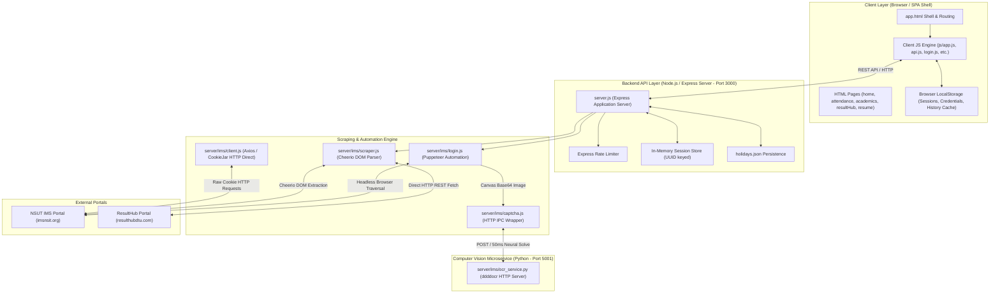
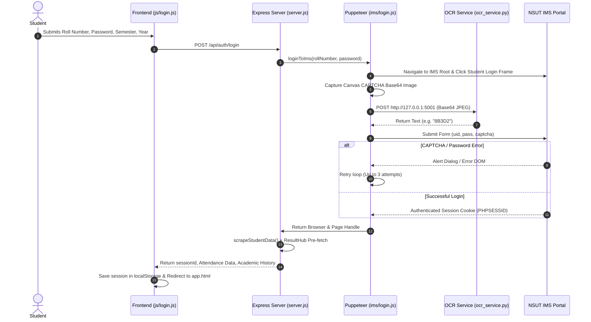

# BunkBuddy System Architecture

Welcome to the architectural documentation for **BunkBuddy** (`bunkbuddy.in`). This document presents a comprehensive, high-level technical overview of the system architecture, application design, component hierarchy, data flow, computer vision CAPTCHA solving pipeline, web scraping engines, and mathematical models used within the platform.

---

## 1. System Overview & Purpose

**BunkBuddy** is an end-to-end academic management, attendance tracking, and performance analytics platform created for students at Netaji Subhas University of Technology (NSUT). The system bridges modern web interfaces with legacy university software systems, offering real-time attendance calculations, bunk margin analytics, academic history tracking, CGPA tracking, calendar management, and resume generation.

### Key Capabilities
- **Automated Authentication & CAPTCHA Bypass**: Autonomous login into the legacy NSUT IMS portal (`imsnsit.org`) using neural computer vision (`ddddocr`).
- **Real-Time Attendance Scraping**: Extracts subject-wise attendance, presents total present/absent counts, and maps subject code legends.
- **Bunk & Goal Calculator**: Computes exactly how many classes a student can safely bunk (or must attend) to maintain a target attendance percentage (default 75%).
- **Academic History & ResultHub Aggregation**: Dynamically integrates with ResultHub (`resulthubdtu.com`) to extract historical semester GPAs, University Ranks, and class standing.
- **Calendar & Academic Scheduling**: Track class schedules, upcoming exams, and admin-managed holiday overrides.
- **Interactive Resume Builder**: Converts student academic metrics into professional resumes directly within the application.

---

## 2. High-Level System Architecture

The following diagram illustrates the complete end-to-end system architecture of BunkBuddy, highlighting the separation of concerns between the single-page application (SPA) frontend, the Node.js Express API server, the Python machine learning microservice, and external web portals.



---

## 3. Core Layered Architecture

BunkBuddy follows a multi-tier architectural strategy designed for rapid data extraction, high throughput, and seamless client execution.

### 3.1 Presentation Layer (Frontend SPA Shell)
- **Architecture**: Single Page Application (SPA) shell architecture centered around [`app.html`](file:///c:/Users/Theam/OneDrive/Desktop/bunkbuddy.in/app.html) with modular partial html views in [`pages/`](file:///c:/Users/Theam/OneDrive/Desktop/bunkbuddy.in/pages/).
- **Dynamic View Loading**: Client-side router loads templates (`home.html`, `attendance.html`, `academics.html`, `resultHub.html`, `resume.html`) into content containers without triggering full page reloads.
- **Styling Design System**: Built with modern CSS custom properties in [`css/app.css`](file:///c:/Users/Theam/OneDrive/Desktop/bunkbuddy.in/css/app.css), glassmorphic card overlays, custom dark mode, responsive mobile drawer navigation, and micro-animations.
- **Visual & Audio Enhancers**: Utilizes Three.js / WebGL background shaders ([`fixShaderEpicenter.js`](file:///c:/Users/Theam/OneDrive/Desktop/bunkbuddy.in/fixShaderEpicenter.js)) and dynamic canvas visualizers.

### 3.2 Application & API Layer (Node.js Express)
- **File Entry Point**: [`server/server.js`](file:///c:/Users/Theam/OneDrive/Desktop/bunkbuddy.in/server/server.js)
- **Process Orchestration**: Automatically spawns and monitors the Python OCR microservice as a child process upon backend startup.
- **Session Management**: Maintains secure `UUIDv4` session objects storing student profiles, attendance payloads, and ResultHub historical academic metrics.
- **Security & Shielding**: Implements `express-rate-limit` protection against automated abuse on authentication routes.

### 3.3 Scraping & Automation Engine
- **File Location**: [`server/ims/`](file:///c:/Users/Theam/OneDrive/Desktop/bunkbuddy.in/server/ims/)
- **Puppeteer Headless Engine**: Executes targeted DOM traversal over NSUT IMS legacy nested HTML `<frameset>` structures.
- **Resource Interception**: Blocks all non-essential web requests (CSS, fonts, analytics, images) except specific CAPTCHA DOM images, accelerating page rendering to under 2 seconds.
- **Cheerio DOM Parsing**: Fast server-side jQuery-like syntax parsing for structured HTML tables (`plum_fieldbig` tables) to extract attendance stats.
- **Axios Direct Fallback**: Leverages `axios-cookiejar-support` to maintain direct session HTTP connections once cookies (`PHPSESSID`) are extracted, skipping browser rendering overhead for sub-requests.

### 3.4 Computer Vision & CAPTCHA Engine
- **File Location**: [`server/ims/ocr_service.py`](file:///c:/Users/Theam/OneDrive/Desktop/bunkbuddy.in/server/ims/ocr_service.py)
- **Technology**: Lightweight Python daemon utilizing `ddddocr` (Deep Learning OCR).
- **RAM Pre-warming**: Model neural weights are loaded into RAM once when the server boots. This reduces CAPTCHA recognition execution time from >2.5s down to `< 50ms`.
- **IPC Interface**: Accepts JSON payload with Base64 encoded JPEG images via local HTTP POST requests on port `5001`.

---

## 4. End-to-End Data Flows

### 4.1 Login & Authentication Flow



---

## 5. Core Mathematical Business Logic

BunkBuddy provides students with immediate clarity on attendance metrics using the following algorithms implemented in [`server/ims/scraper.js`](file:///c:/Users/Theam/OneDrive/Desktop/bunkbuddy.in/server/ims/scraper.js) and rendered via [`js/app.js`](file:///c:/Users/Theam/OneDrive/Desktop/bunkbuddy.in/js/app.js):

### 5.1 Target Attendance Formula
Let:
- $T$ = Total Classes Conducted
- $P$ = Classes Present
- $A$ = Classes Absent ($A = T - P$)
- $R$ = Target Attendance Percentage Threshold (e.g., $0.75$ for 75%)

#### 1. Classes Bunkable ($X$)
When current attendance percentage $\frac{P}{T} > R$, the number of upcoming classes a student can safely miss before dropping below $R$ is:

$$X = \left\lfloor \frac{P - R \cdot T}{R} \right\rfloor = \left\lfloor \frac{4}{3} \cdot A - T \right\rfloor \quad (\text{for } R = 0.75)$$

#### 2. Classes Required ($Y$)
When current attendance percentage $\frac{P}{T} < R$, the number of consecutive upcoming classes a student must attend to reach $R$ is:

$$Y = \left\lceil \frac{R \cdot T - P}{1 - R} \right\lceil = \left\lceil 3 \cdot T - 4 \cdot A \right\rceil \quad (\text{for } R = 0.75)$$

---

## 6. Directory Structure & File Map

Below is a map of the BunkBuddy repository structure:

```
bunkbuddy.in/
├── app.html                  # Main SPA Application Shell & Routing Host
├── index.html                # Public Landing Page & Login Interface
├── pricing.html              # Marketing Page - Pro Plan Details
├── legal.html                # Legal Information Page
├── privacy.html              # Privacy Policy Document
├── refund.html               # Refund Policy Document
├── terms.html                # Terms of Service Document
├── scraper_architecture.md   # Deep-dive Scraper Engine Technical Specs
├── architecture.md           # Master System Architecture (This File)
│
├── css/                      # Application Stylesheets
│   ├── app.css               # Design System, Glassmorphic Utility Classes & Mobile Shell CSS
│   ├── app-extra.css         # Component Extensions & Modal Overlays
│   └── resume.css            # Print & Interactive Resume Generator Styling
│
├── js/                       # Client-Side Application Logic
│   ├── api.js                # REST API Client Abstraction & LocalStorage Session Management
│   ├── app.js                # Main SPA Controller, Attendance Engine, & View Renderer
│   ├── login.js              # Authentication UI Handler & Terminal Logs Emulator
│   ├── calendar.js           # Interactive Academic Calendar & Holiday Renderer
│   ├── resulthub.js          # ResultHub Data Explorer & Batch Rank Viewer
│   ├── resume.js             # Resume Builder Interactive Form & Canvas Exporter
│   ├── community.js          # Community Portal Scripts & Discussion Hooks
│   └── anti-debug.js         # Client Security & Anti-Inspection Guard Script
│
├── pages/                    # Dynamic SPA Views (Loaded asynchronously into app.html)
│   ├── home.html             # Dashboard Overview (Attendance Cards, Quick Stats)
│   ├── attendance.html       # Detailed Subject-wise Attendance Breakdown
│   ├── academics.html        # Academic Performance, Credits, & GPA History
│   ├── resultHub.html        # University Rank Explorer & Batch Metrics
│   ├── resume.html           # Professional Resume Generator Page
│   ├── resources.html        # Study Notes, Syllabus, & Question Papers
│   ├── pro.html              # BunkBuddy Pro Features Showcase
│   └── connect.html          # Community & Social Connect Page
│
└── server/                   # Backend Application Server (Node.js + Python Microservices)
    ├── server.js             # Express API Server, Session Map, & Process Spawner
    ├── package.json          # Node Server Dependencies & Execution Scripts
    ├── holidays.json         # Persistent Custom Holiday Database
    ├── eng.traineddata       # Tesseract OCR Trained Data Assets (Fallback)
    │
    └── ims/                  # Scraping Engine & CAPTCHA Solver Module
        ├── ocr_service.py    # Python ddddocr Model HTTP Microservice (Port 5001)
        ├── captcha.js        # Node.js Client Wrapper for Python OCR Service
        ├── login.js          # Puppeteer Headless IMS Navigator & Login Solver
        ├── scraper.js        # Cheerio Attendance Parser & ResultHub Integration
        └── client.js         # Direct Axios Cookie-Jar HTTP Session Client
```

---

## 7. Security, Resilience & Performance Features

1. **Anti-Debugging Guard**: Client-side [`js/anti-debug.js`](file:///c:/Users/Theam/OneDrive/Desktop/bunkbuddy.in/js/anti-debug.js) detects browser developer tools tampering to protect student data privacy.
2. **Aggressive Resource Interception**: Puppeteer drops fonts, stylesheets, and third-party scripts on `imsnsit.org`, speeding up login DOM rendering by over ~70%.
3. **Persisted Local Model**: Running `ddddocr` as a persistent Python background process eliminates model loading time per login attempt.
4. **Resilient Retry Loop**: Automates retry attempts on invalid CAPTCHA entries with clear status reporting back to the client UI.
5. **Parallel Scraping Hooks**: Merges IMS attendance data with historical ResultHub records in parallel promises to minimize response latency.

---

## 8. Related Architectural References

For in-depth details on the web scraper and computer vision implementation, refer to:
- [`scraper_architecture.md`](file:///c:/Users/Theam/OneDrive/Desktop/bunkbuddy.in/scraper_architecture.md): Specialized technical documentation for the CAPTCHA OCR pipeline and IMS frame navigation strategy.
